# Care-2-Share

[Care-2-Share](https://flask-dutch-life-project.herokuapp.com/welcome) website is representative of the community where I live. On my walks through our neighbourhood I have often come accross casual displays of generosity. It is not strange to find a table on the front lawn of a property, displaying fruits, vegetables, eggs, plant seedlings, honey, home made jams, second hand books, childrens' toys. The offerings vary. Sometimes just a few products, sometimes a lot.  There would be a sign that says help yourself, sometimes it may indicate you can take what you need and leave a small fee if you wish. Even though the random offerings are quite wonderful to come accross, not all streets are busy, the weather can ruin a splendid gesture... and off course the birds may get into the fruits...
I have seen people make random posts on social media inviting strangers to contact them if they feel alone and would like to join for a family dinner. In winter I have often seen posts about soups being made, to share.  I have seen a couple invite strangers to make use of their large garden for picnics or barbeques.  
I have been in this country for three years and admit that even though the pandemic basically halted the sense of community for about two years, people seem eager to once again engage with their fellow human beings. It is not just about the people being approachable, my new countrymen and women do not like letting anything go to waste. I have read that the Netherlands is a circular economy (in process off course), but it is very apparent from my perspective.  Wearing previously loved clothes is fashionable.  Bicycles are being passed on (and I am not referring to the ones being taken without permission....).  
Developing this website brought me great joy and I would love to get it ready to share with the community.  I would definitely be an active participant.  I have made my share of petfood donations (my cats insist they want a varied diet, and once I buy enough to last a while they change their minds and we end up with tins, pouches and bags of catfood that I know could be well enjoyed by other, less fussy felines in our neighbourhood).
In my opinion I now live in a community that can appreciate diversity and enjoy some of the simple joys life can offer, like sharing rather than letting those extra eggs or apples go to waste.
This website is a tool that the community can use to ensure those products are shared, before the "best before" time runs out. (even then it may still not go to the waste bin !)  Care-2-Share can enable like minded people to connect and as a result this website came to fruition, yes sharing is caring. 
The site enables members from the community to register as an online member, browse what is on offer, add their own offerings to the list, amend and delete their offers when required. When new members sign up, they need to provide their postal code to confirm they are from the area.  It is not a security layer but more an informal manner for keeping it within the community. At this stage this is still a manual check being attended to by the site owner, with the intention to change the code to only allow new members to sign up should their postal codes correspond with specific parameters (for the area).  Visitors may also contact the admin (site owner) by sending an email.  

For the community the value of the site is an easy to use platform to do what they have been doing, for the site owner it is pure enjoyment of finding the like minded sharing and caring attitude of other community members aiming to not let any peasoup or "oliebollen" go to waste.

The website is not area specific and can very easily be adapted / applied for other areas / communities, if desired.

## User Experience (UX)

### User stories

- As a First Time User, I want:
    - the home page to clearly indicate its intention and target group.
    - to find the home page familiar to my experience in my area and feel welcome/enticed to join this online community platform
    - each page to clearly indicate the navigation possibilities of the site.
    - to find the website easy to navigate and move between the pages of the site.
    - to find the rules and guidelines of the website clear and not too formal
    - to be able to browse through the list/s of offerings from my community
    - to know exactly when offerings are available
    - to know whether any expiry date relates to a specific offering
    - to be able to register as a member of the community and as a result be able to access more functions on the site such as posting/editing/deleting my own offerings
    - to be able to post my own offerings with ease of use
    - to change / amend any of my offerings with ease of use
    - to delete my offerings with ease of use
    - to be able to access the site from different devices, thus the site must be responsive
    - to be able to communicate with the site owner, should I have suggestions, queries, concerns or maybe even a compliment

- As a Returning User(registered member), I want to:
    - know that registered members are from my community/area/vicinity, thus the area code checking when registering as a user is a good feature of the site
    - find it easy to log into my account
    - find it easy to log out of my account
    - find it easy to add new offerings
    - find it easy to amend my offerings
    - find it easy to delete any / or all of my offerings
    - find it easy to search for offerings on the site
    - be able to communicate with the site owner / administrator should I need to

- As the Site Owner I want to:
    - provide a site that is clear in its intention
    - provide the community with a user-friendly site where they can share their offerings with one another and as a result try and share where applicable fresh meals / produce before an expiry date arise, where applicable
    - promote / further the sharing and caring attitude of the community by bringing them together and enabling them to "find" one another in a easy to navigate and safe environment
    - as a minimum requirement, require a postal code when new members register to try and keep this initiative within the intended community, to also keep it practical from a distance perspective when offering/collecting/getting together etc.
    - keep the site relevant and simple to use, thus ensuring the site stays fresh and relevant, I need to be able to delete any expired offers(if not removed by the members), delete complete inactive members(which may have relocated....?)
    - easily create new categories, if a need arises (as may be requested by a community member (if request/s received via email)
    -  be able to store as much data as needed to be able to host the offerings from the community 
    -  ensure that the site is accessible from all device sizes
    -  ensure that members are not able to access the profile of other members and only be able to access, add, delete, amended offerings created from their own profiles
    -  host a friendly community site easy to use by young and old
    -  be able to receive communication / feedback / requests from the community via the contact details provided (as far as possible and applicable) keep the site reflective of the community and its members

### Strategy

The main aim and focus of Care-2-Share is to enhance the experience of living in the community of Katwijk:
    - by bringing like minded people together
    - by making it apparent that people do care and that a sense of community is alive and well in the 21st century
    - by providing a platform where people can easily and clearly indicate what they would like to share with and within their community
    - by enabling the community to enjoy the offerings from within their community
    - by enabling the members of the community to get closer to living with zero waste

### Scope

Initial release: Functional specifications
- the design and layout should be kept simplistic throughout and very easy to use (taking time to give away free meals, products, invite strangers to picnics and barbeques should not become a cumbersome exercise)
- all pages should clearly indicate all the clickable links in the navigation bar, on all types of devices
- the home page should provide basic information and be clear about the purpose of the website
- the registration page is where a member can register to enable them to have a profile on the website, which will grant them access to the offers page and enable them to post their own offerings, amending and / or deleting same. Said page will require a username, firstname, surname, postal code and password to be inserted.
- disclaimer, rules and guidelines at the bottom of the registration page are just a few basic rules / guidelines which new members are required to read when signing up, and reading same needs to be confirmed by clicking the check box which will enable their registration to be complete
- in an attemt to keep the website a friendly environment for all (prior to making the site available for the public, consulation with a law practitioner will be required to ensure that the disclaimer meets the needs of the site owner and is in accordance with the governing laws, further consideration of good conduct rules may be considered, prior to providing a feature where the members may be enabled to upload images, privacy laws need to be considered and further guidelines in regards thereto may need to be reflected on the site.)
- the login page will enable a registered member to access their profile by inserting their username and password and thus gaining access to their profile and all available offers
- the logout menu item will enable a member to log out of their profile
- offers, the main purpose of the website, where all the offers and invitations happen consists of various categories such as meals, produce, pets related, garden, household, bicycles, invitations, other.
- contact admin page is where the site owner provides contact details to the public and no registration is required to visit said page.  Registered members and/or the public will be allowed to contact the site ownwer, should they require assistance, have queries, suggestions, complaints, concerns, compliments, etc.

Possible future release:
- depending on the outcome of legal consultation and depending whether required / requested by the members of the site, the site owner will consider enabling members to upload photographs of their offerings, however said photographs will have to be authorised by the site owner before appearing on the site to ensure suitability such as privacy laws etc where not breached.
- FAQ: frequently asked questions page may be considered and developed, based upon community interaction via the email form.

### Structure

The purpose of the website is to bring members of the community together by enabling them to easily share with one another, whether it be a meal, a barbeque event or childrens' toys.  The website is structured for absolute ease of use by new and existing members.  The site has a logical and easy flow, ensuring a positive user experience.  The structure was developed with that in mind.
- The initial website consists of:
    -   Welcome page - available to the public and giving basic information about the website
    -   Login page - to enable registered members to log into the website which will allow access to their own profile page, the all offers page and new offers page
    -   Register page - for new/unregistered members to be able to register and thus get access to all the content of the website. For registration they need to create a username
        provide their firstname, surname and postal code, create their own password and confirm that they agree to abide by the rules as set out on the bottom of the
        registration page by clicking the checkbox provided (a requirement before registration can take place)
    -   Contact Admin page - provides both registered members and unregistered users access to obtain contact details of the site administrator, such as a contact number, email 
        address, office address and available hours
    -   Profile page - reflects the registered user's username, firstname, surname, postal code and password. The registered user can change their password on this page, should they
        want / need to at any stage after their initial registration.
    -   All Offers page -  this page has the option for the registered and logged in user to see all the available offers, to filter the offers by category, to filter the page to 
        only see the offers of the registered user, to clear the filters and to edit or delete their own offers.  Registered members do not have the option to delete or edit offers of other members. No edit or delete buttons appear on the offers of other members.
    -   New Offers page - once a registered member is logged in, they can add their own offer which will appear on the All Offers page.  To add an offer, a member must first elect a 
        category from the drop down list, thereafter provide an offer name, then a description of the offer, provide a collection address, collection date and there is an option to reflect the collection start time and expiry time. A member can also indicate whether the offering is a hot or a cold product, which may be relevant for any persons considering collection of said offering.
    -   Logout in the nav bar - by clicking on the Log Out tab in the navigation bar a registered user is easily logged out of their profile and the registered section of the site.

The data schema below was prepared by using [Lucid.app](https://lucid.app/)

 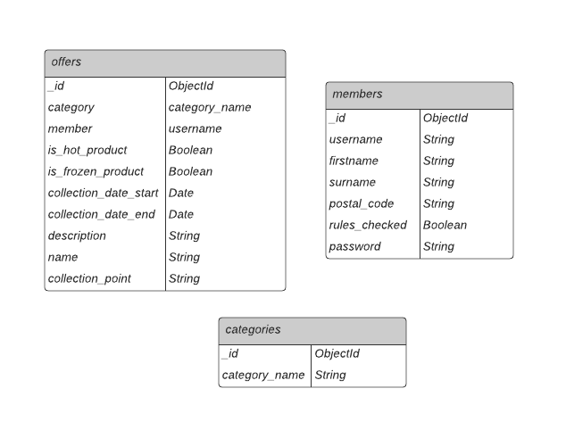

The sitemap was prepared using [Gloomaps](https://www.gloomaps.com/nMkFjnEiHn)

### Skeleton

- Considering the strategy, scope and structure the following wireframes were created:

    - Desktop and mobile:

        - Welcome

            

        - LogIn

            

        - Register

            

        - Contact Admin

            
            
        - All Offers

            

        - Profile

            

        - New Offers

            

        - Log Out

            

       

### Surface

- The clickable logo and navigation bar is consistently located on each page, allowing an intuitive user experience
- The images shown on the site, reflects the Katwijk community, which images in itself will draw the community members in as they would be curious about the happenings in their  
  direct environment
- The layout has been kept very clean and simple as the site is aimed at absolutely all persons within the Katwijk community, young and old, from all backgrounds
- The colours taken from the Materialize Color Palette was also kept very simple and more shades of the same colors were used in stead of a greater variety of colours, also to keep
    the site looking calm and relaxing.  The colours were also chosen reflect the blue skye, green of the trees and the colours of the incredible blue and green building.

        "Cool colors include green, blue, and purple, are often more subdued than warm colors. They are the colors of night, of water, of nature, and are usually calming, relaxing, and somewhat reserved.

        Blue is the only primary color within the cool spectrum, which means the other colors are created by combining blue with a warm color (yellow for green and red for purple).

        Because of this, green takes on some of the attributes of yellow, and purple takes on some of the attributes of red. Use cool colors in your designs to give a sense of calm or professionalism." Taken from (https://www.smashingmagazine.com/2010/01/color-theory-for-designers-part-1-the-meaning-of-color/)

- Screenshots reflecting the following pages:

    - For desktop, laptop, tablet and mobile:

        - Welcome

            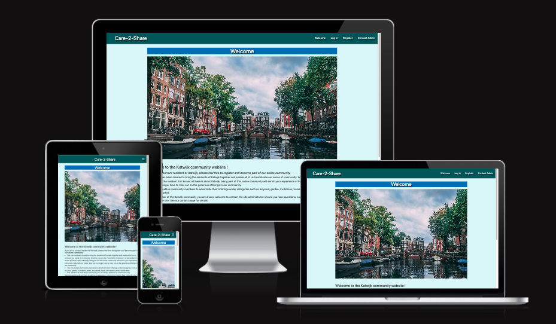

        - LogIn

            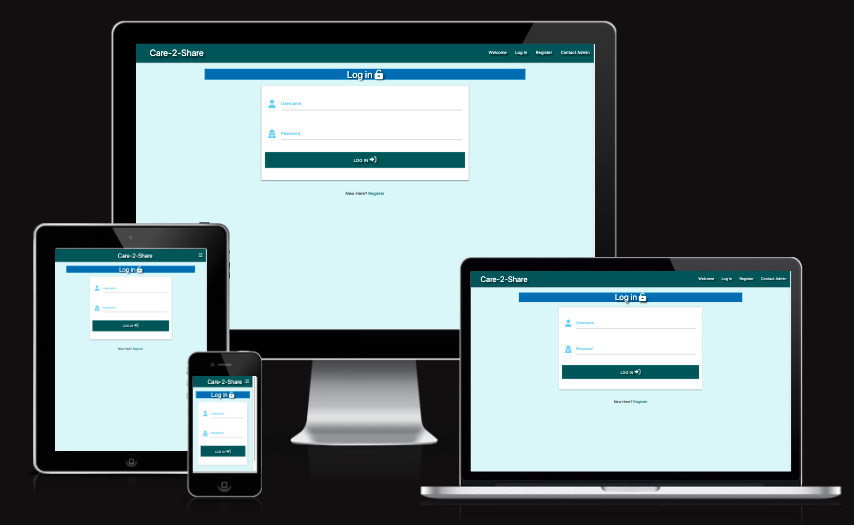

        - Register

            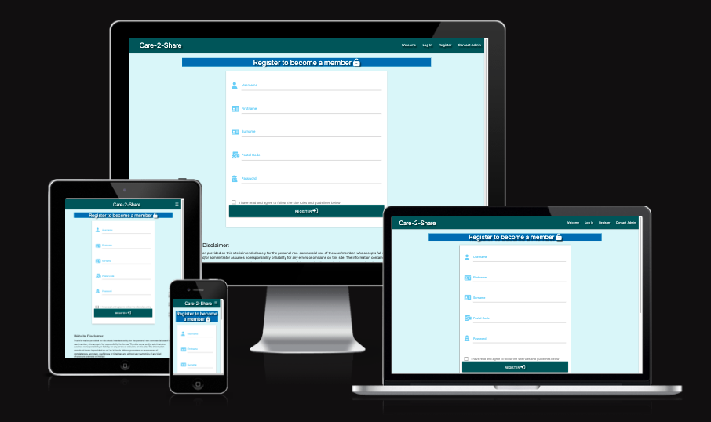
            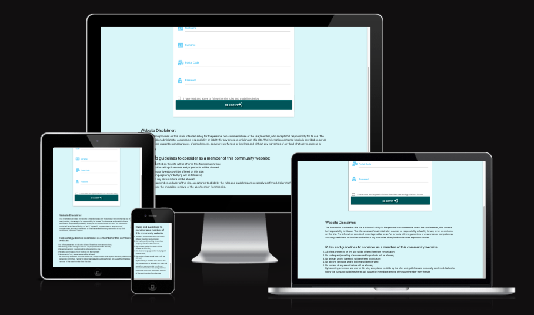

        - Contact Admin

            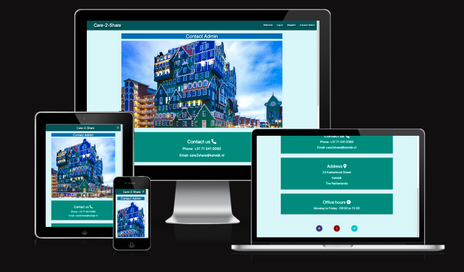
            
        - All Offers

            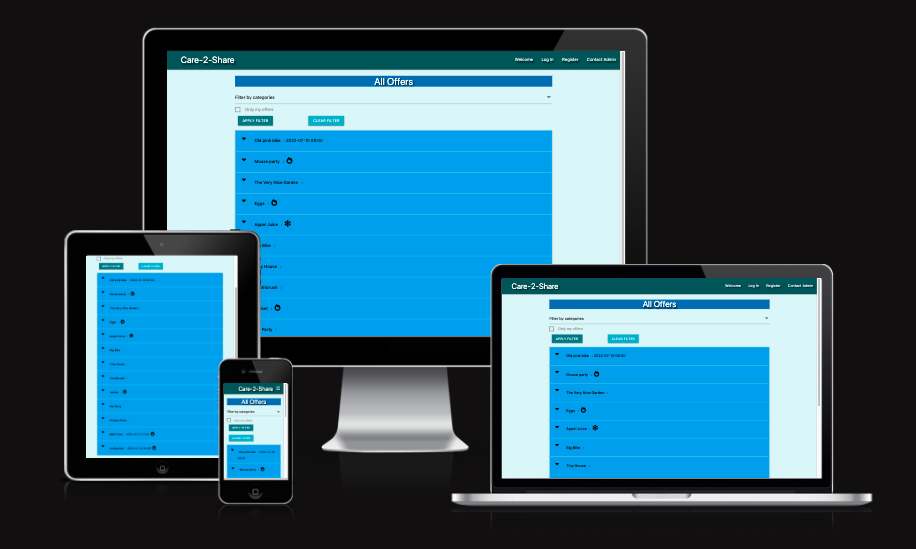

        - Profile

            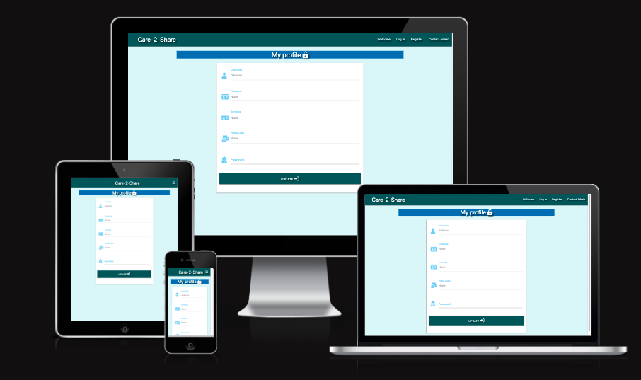

        - New Offers

            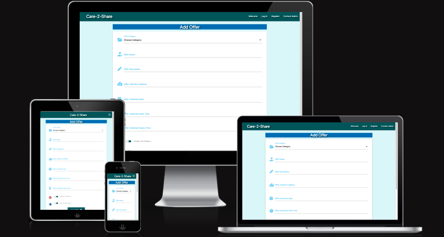

        - Log Out

            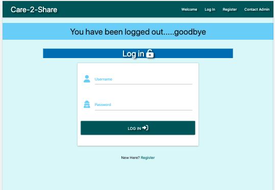

            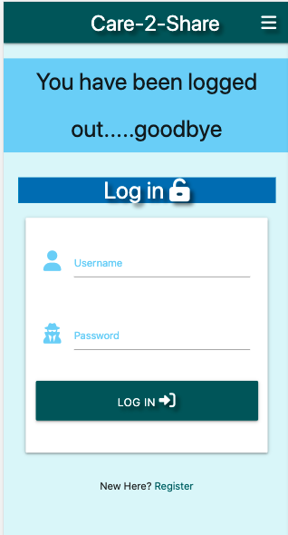

   

## Features

### Existing Features

#### Common Page features

- Logo
    - The logo is clickable and provides an easy way to navigate back to the welcome page
    - It is consistently located on each page allowing the user to easily find it
  
- Navigation Bar
    - Consistently located on each page allowing an intuitive user experience
    - Provides links to the Welcome, LogIn, Register, ContactAdmin, AllOffers, Profile and NewOffers pages and the LogOut tab

- Footer
    - Pinned at the bottom of the welcome and contact admin page, provides clickable links to facebook, instagram and twitter

    
#### Page specific features

-   Welcome page - available to the public and giving basic information about the website and providing a photograph of the neighbourhood
-   Login page - for completion of the username and password and clicking on the login link to enable registered members to log into the website 
-   Register page - for new/unregistered members to enable registration by completing their username, providing their firstname, surname and postal code, creating their own password 
    and confirming that they agree to abide by the rules as set out on the bottom of the registration page by clicking the checkbox provided (a requirement before registration can take place). When hovering over the Password space, a tip appears to indicate that a password length must be between 5 and 100 and alphanumerical.
-   Contact Admin page - provides both registered members and unregistered users access to obtain contact details of the site administrator, such as a contact number, email 
    address, office address and available hours and providing another photograph of the neighbourhood
-   Profile page - reflects the registered user's username, firstname, surname and postal code. The registered user can change their password on this page, should they
    want / need to at any stage after their initial registration. When hovering over the Password space, a tip appears to indicate that a password length must be between 5 and 100 and alphanumerical
-   All Offers page -  this page has the option for the registered and logged in user to see all the available offers, to filter the offers by category, to filter the page to 
    only see the offers of the registered user, to clear the filters and to edit or delete their own offers.  Registered members do not have the option to delete or edit offers of other members. No edit or delete buttons appear on the offers of other members. When hovering over the ApplyFilter button, a tip appears to assist the user when making use of this page
-   New Offers page - once a registered member is logged in, they can add their own offer which will appear on the All Offers page.  To add an offer, a member must first elect a 
    category from the drop down list, thereafter provide an offer name, then a description of the offer, provide a collection address, collection date and there is an option to reflect the collection start time and expiry time. A member can also indicate whether the offering is a hot or a cold product, which may be relevant for any persons considering collection of said offering
-   Logout in the nav bar - by clicking on the LogOut tab in the navigation bar a registered user is easily logged out of their profile and the registered section of the site

## Testing

### Layout

* Page title remains constant for all pages
* Logo location always remains constant
* Navigation bar location always remains constant
* Footer remains pinned to bottom of browser window
* Content pages header location remains constant on each page

### Navigation

* Clicking the logo navigates to landing page in the same tab
* Clicking the navigation menu items navigates to the correct site page in the same tab
* Clicking the social media links navigate to the correct external social media site in a new tab

### Form

* Input form validates required input fields and guides the user correctly to remedy the problem
* Submit button submits to the CI backend and displays information in a new tab

### UX

* Each page has ______________
* The selected navigation menu item ________________________________

### Testing User Stories from the UX Section

### User stories

- As a First Time User, I want:
    - the home page to clearly indicate its intention and target group.
    - to find the home page familiar to my experience in my area and feel welcome/enticed to join this online community platform
    - each page to clearly indicate the navigation possibilities of the site.
    - to find the website easy to navigate and move between the pages of the site.
    - to find the rules and guidelines of the website clear and not too formal
    - to be able to browse through the list/s of offerings from my community
    - to know exactly when offerings are available
    - to know whether any expiry date relates to a specific offering
    - to be able to register as a member of the community and as a result be able to access more functions on the site such as posting/editing/deleting my own offerings
    - to be able to post my own offerings with ease of use
    - to change / amend any of my offerings with ease of use
    - to delete my offerings with ease of use
    - to be able to access the site from different devices, thus the site must be responsive
    - to be able to communicate with the site owner, should I have suggestions, queries, concerns or maybe even a compliment

- As a Returning User(registered member), I want to:
    - know that registered members are from my community/area/vicinity, thus the area code checking when registering as a user is a good feature of the site
    - find it easy to log into my account
    - find it easy to log out of my account
    - find it easy to add new offerings
    - find it easy to amend my offerings
    - find it easy to delete any / or all of my offerings
    - find it easy to search for offerings on the site
    - be able to communicate with the site owner / administrator should I need to

- As the Site Owner I want to:
    - provide a site that is clear in its intention
    - provide the community with a user-friendly site where they can share their offerings with one another and as a result try and share where applicable fresh meals / produce before an expiry date arise, where applicable
    - promote / further the sharing and caring attitude of the community by bringing them together and enabling them to "find" one another in a easy to navigate and safe environment
    - as a minimum requirement, require a postal code when new members register to try and keep this initiative within the intended community, to also keep it practical from a distance perspective when offering/collecting/getting together etc.
    - keep the site relevant and simple to use, thus ensuring the site stays fresh and relevant, I need to be able to delete any expired offers(if not removed by the members), delete complete inactive members(which may have relocated....?)
    - easily create new categories, if a need arises (as may be requested by a community member (if request/s received via email)
    -  be able to store as much data as needed to be able to host the offerings from the community 
    -  ensure that the site is accessible from all device sizes
    -  ensure that members are not able to access the profile of other members and only be able to access, add, delete, amended offerings created from their own profiles
    -  host a friendly community site easy to use by young and old
    -  be able to receive communication / feedback / requests from the community via the contact details provided (as far as possible and applicable) keep the site reflective of the community and its members

### Manual Testing of Functionality

 - Welcome page
 
 - LogIn page

- Register page

- Contact Admin page

            
- All Offers page

- Profile page

- New Offers page

- Log Out tab in navigation bar

### Validator Testing

- HTML
    - No html errors were returned for the ...... page when passing through the official [W3C validator](https://validator.w3.org/nu/...........morpheus-23.github.io...............html)

    - Various errors where returned for the ..............page when passing through the official [W3C validator](https://validator.w3.org/nu...............

- CSS
    - No CSS errors were found when passing through the [(Jigsaw) validator]
    - [home page](https://jigsaw.w3.org/css-validator/validator?uri=https%3A%2F%2Fmorpheus-23.github.io............

- Google Chrome Lighthouse
    - 
    - 

### Fixed

### Unfixed Bugs

* See various .....................................

## Deployment

### GitHub Pages

- The site is deployed to GitHub pages. The steps to deploy were as follows:
    - Log into GitHub and locate the My-dutch-life GitHub repository, navigate to the Settings tab and select the Pages 
    - From the source section drop-down menu, select the Master Branch
- The live link can be found here - [https://flask-dutch-life-project.herokuapp.com/welcome)

### Making a Clone

- Log into GitHub and locate the My-dutch-life GitHub repository
- Click on the My-dutch-life repository
- Click on the Code button
- Choose the HTTPS option, then click on the clipboard right of the URL
- Then choose your IDE or editor of choice
- Open a respository or create a new repository 
- Open the terminal and type "git clone" and paste the URL copied above 
    git clone https://github.com/Morpheus-23/my-dutch-life.git
- press enter and the clone will be created

### Forking the repository for own use

- Log into GitHub and locate the My-dutch-life GitHub repository
- Click on the My-dutch-life repository
- Click on the Fork button
- 

### Heroku

Deployment

steps

## Technologies Used

Languages
- HTML5
- CSS3
- Javascript
- Python

Frameworks, libraries and others

-   Flask - micro framework for building applications
-   FlaskPyMongo - provides MongoDB support for Flask applications
-   Werkzeug - a library framework (https://werkzeug.palletsprojects.com/)
-   MongoDB - hosting the database in a cloud environment (https://www.mongodb.com/)
-   Gitpod - developing the site (https://www.gitpod.io/)
-   Github - version control and hosting the repository (https://github.com/)
-   Heroku - deploy the live site (https://dashboard.heroku.com/apps)
-   Pip - package installer for Python
-   dnspython - a toolkit for Python
-   jQuery (https://releases.jquery.com/)
-   Jinja (https://jinja.palletsprojects.com/en/3.0.x/templates/#)
-   RandomKeyGen (https://randomkeygen.com/)

## Unimplemented assessment criteria

* Styling can be more compact and less inline.
* Better defensive programming can be applied.
* Features for the site administrator can be developed so that new categories can be created by the administrator on the website and not just from MongoDB.
* Better wireframes could be done by making use of Balsamic, to replace the hand drawn wireframes.
* A more complete description of technologies used with their relevant links

## Content

- All icons were taken from [Font Awesome](https://fontawesome.com/)

- All images were taken from [Pexels](https://pexels.com/)
    -   Welcome page (Photo by Chait Goli: https://www.pexels.com/photo/photo-of-boats-parked-on-river-2031706/)
    -   Contact admin page (Photo by Teodor Savin: https://www.pexels.com/photo/green-and-blue-painted-house-600622/)

- The sitemap was prepared using [GlooMaps](https://gloomaps.com/)

- The database schema was prepared using [Lucid.app](https://lucid.app/)

- Fonts were utilised from [GoogleFonts](https://fonts.google.com/)

- Font and background colours and some functionalities were taken from [Materialize](https://materializecss.com/)

- Responsiveness was tested and screenshots were taken from [AmIResponsive](https://ui.dev/amiresponsive)

- Some design ideas were taken from the Code Institute Backend Development Mini Project.

- Some technical implementation information was taken from [StackOverflow](https://stackoverflow.com/)
    -   https://stackoverflow.com/questions/30207047/how-to-get-multi-select-dropdown-in-materialize-css
    -   https://stackoverflow.com/questions/69950552/mongodb-update-i-cant-update-my-documents-in-mongodb-with-flask-api
    -   https://stackoverflow.com/questions/11774265/how-do-you-access-the-query-string-in-flask-routes
    -   https://stackoverflow.com/questions/23577172/mongodb-pymongo-querying-multiple-criteria-unexpected-results

- Some technical information was taken from [Freecodecamp](https://freecodecamp.org/)
    -   https://www.freecodecamp.org/news/python-list-length-how-to-get-the-size-of-a-list-in-python/

- Some technical information was taken from [Digitalocean](https://digitalocean.com/)
    -   https://www.digitalocean.com/community/tutorials/css-prevent-line-break

- Some technical information was taken from [Youtube](https://www.youtube.com/c/CodersPage)
    -   https://www.youtube.com/watch?v=dQ2niRl2Lek

- I made use of[W3Schools](https://www.w3schools.com/) for help with html and css.

