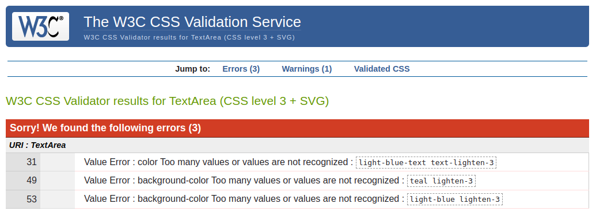
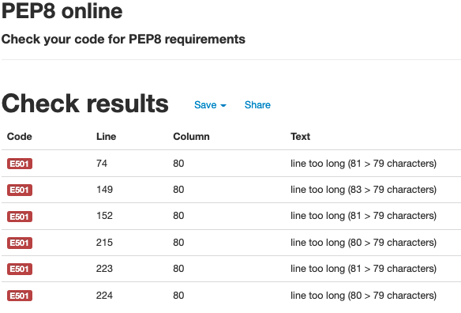
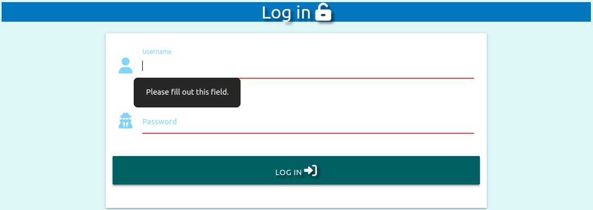
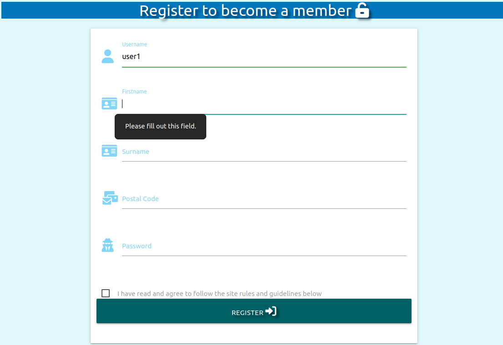
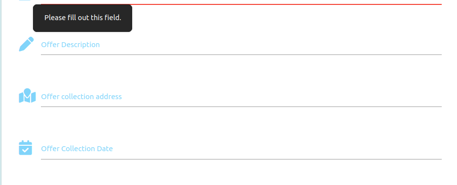

# Testing

## Table of Contents
- [Testing](#testing)
  - [Table of Contents](#table-of-contents)
  - [Code Validation](#code-validation)
    - [HTML Validation](#html-validation)
    - [CSS Validation](#css-validation)
    - [JavaScript Validation](#javascript-validation)
    - [Python Validation](#python-validation)
  - [User Stories](#user-stories)
    - [Testing User Stories from the UX Section](#testing-user-stories-from-the-ux-section)
    - [User stories](#user-stories-1)
    - [Manual Testing of Functionality](#manual-testing-of-functionality)


## Code Validation

### HTML Validation
All HTML pages were tested using [W3C Markup Validation](https://validator.w3.org/). 
- Page source were passed through the validator
  - Welcome page: li bullets disappear if div is changed to ul 
  - Login page: No errors
  - Register page: 
    - Error: No p element in scope but a p end tag seen. 
  - Contact Admin page: No errors
  - All offers: No errors
  - Profile: No errors
  - Add offer: No errors


### CSS Validation 
The [W3C CSS Validator](https://jigsaw.w3.org/css-validator/) was used to test the style.css file and has these errors: 

 


### JavaScript Validation 

[JSHint Validator](https://jshint.com/) was used to validate script.js and has two warnings:

```
Metrics
There are 8 functions in this file.

Function with the largest signature take 0 arguments, while the median is 0.

Largest function has 8 statements in it, while the median is 2.5.

The most complex function has a cyclomatic complexity value of 3 while the median is 1.5.

Two warnings
24	'let' is available in ES6 (use 'esversion: 6') or Mozilla JS extensions (use moz).
25	'let' is available in ES6 (use 'esversion: 6') or Mozilla JS extensions (use moz).

``` 


### Python Validation 

[PEP8 Online](http://pep8online.com/) validator was used to test the app.py file.



## User Stories

### Testing User Stories from the UX Section

### User stories

- As a First Time User, I want:
    - the home page to clearly indicate its intention and target group.
      - passed
    - to find the home page familiar to my experience in my area and feel welcome/enticed to join this online community platform
      - passed
    - each page to clearly indicate the navigation possibilities of the site.
      - passed
    - to find the website easy to navigate and move between the pages of the site.
      - passed
    - to find the rules and guidelines of the website clear and not too formal
      - passed
    - to be able to browse through the list/s of offerings from my community
      - passed
    - to know exactly when offerings are available
      - passed
    - to know whether any expiry date relates to a specific offering
      - passed, but only on exapnding the item
    - to be able to register as a member of the community and as a result be able to access more functions on the site such as posting/editing/deleting my own offerings
      - passed
    - to be able to easily post my own offerings
      - passed
    - to ieasily change / amend any of my offerings
      - passed
    - to deasily delete my offerings
      - passed
    - to be able to access the site from different devices, thus the site must be responsive
      - passed, responsiveness tested with tools and not actual devices
    - to be able to communicate with the site owner, should I have suggestions, queries, concerns or maybe even a compliment
      - passed

- As a Returning User(registered member), I want to:
      - know that registered members are from my community/area/vicinity, thus 
        - passed: the area code is captured during registration
    - find it easy to log into my account
      - passed
    - find it easy to log out of my account
      - passed
    - find it easy to add new offerings
      - passed
    - find it easy to amend my offerings
      - passed
    - find it easy to delete any / or all of my offerings
      - passed
    - be able to communicate with the site owner / administrator should I need to
      - passed

- As the Site Owner I want to:
    - provide a site that is clear in its intention
      - passed, the welcome page explains it
    - provide the community with a user-friendly site where they can share their offerings with one another and as a result try and share where applicable fresh meals / produce before an expiry date arise, where applicable
      - passed
    - promote / further the sharing and caring attitude of the community by bringing them together and enabling them to "find" one another in a easy to navigate and safe environment
      - passed
    - as a minimum requirement, require a postal code when new members register to try and keep this initiative within the intended community, to also keep it practical from a distance perspective when offering/collecting/getting together etc.
      - passed
    - keep the site relevant and simple to use, thus ensuring the site stays fresh and relevant, I need to be able to delete any expired offers(if not removed by the members), delete complete inactive members(which may have relocated....?)
      - passed, but has to be done in Mongodb directly
    - easily create new categories, if a need arises (as may be requested by a community member (if request/s received via email)
      - passed, but has to be done in Mongodb directly
    -  be able to store as much data as needed to be able to host the offerings from the community
       -  Capacity of Mongodb Atlas not tested
    -  ensure that the site is accessible from all device sizes
       -  passed, responsiveness tested with tools and not actual devices
    -  ensure that members are not able to access the profile of other members and only be able to access, add, delete, amended offerings created from their own profiles
       -  passed. Logged in username is stored in the session and verified before these activities
    -  host a friendly community site easy to use by young and old
       -  actual UX user test was not done
    -  be able to receive communication / feedback / requests from the community via the contact details provided (as far as possible and applicable) keep the site reflective of the community and its members
       -  passed


### Manual Testing of Functionality


 - Welcome page
   - displays as expected

 - Log In page
   - passed. Verifies user input and mandatory fields 
  
 


- Register page

   - passed. Verifies user input and mandatory fields 
  
 

- Contact Admin page 
  - passed. Contains the required contact options 


- All Offers page 
  - Bug: Categories filter selection is lost when filter is applied
  - The rest behaves as expected


- Profile page
  - passed. Password can be changed and is validated


- New Offers page
  - passed. Verifies user input and mandatory fields 

 


- Log Out tab in navigation bar
  - passed
